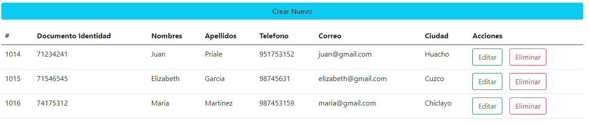
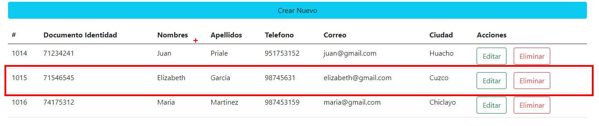
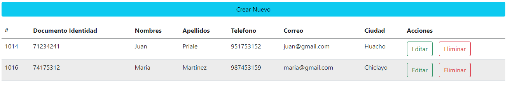
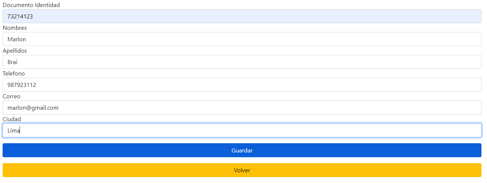
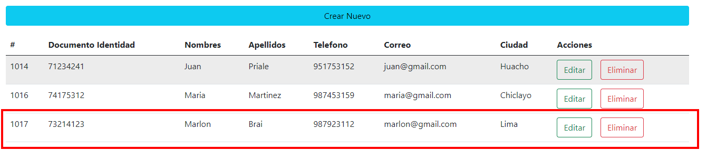
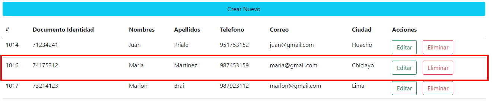
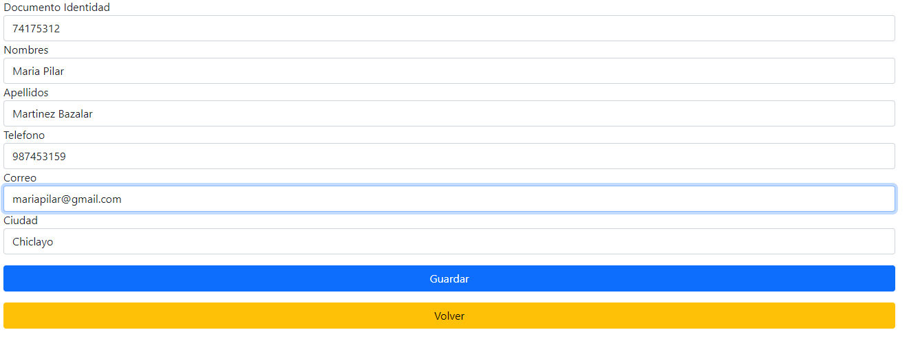
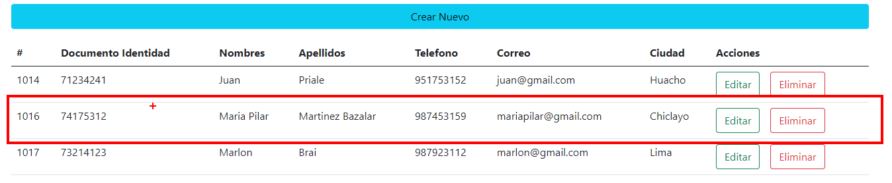

# Gestor de Usuarios - API

## Leer

## Eliminar
| Antes | Después |
|-|-|
|  |  |

## Create
| Antes | Después |
|-|-|
|  |  |

## Edit
| Antes | Durante |
|-|-|
|  |  |

|Después |
|-|
| 

